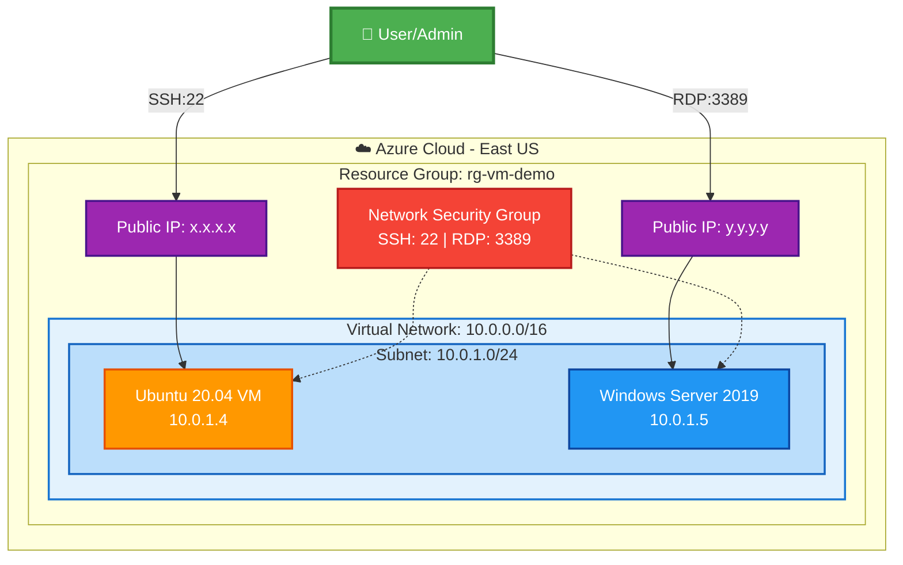

# Azure VM Provisioning with Terraform

## 📋 Project Overview

This project provisions Azure Virtual Machines (Windows Server 2019 and Ubuntu 20.04) on a Virtual Network with proper networking configuration, equivalent to AWS EC2 provisioning on VPC.

### What We're Achieving

- ✅ Create Azure Virtual Network (VNet) and Subnet
- ✅ Configure Network Security Groups (NSG) with SSH and RDP rules
- ✅ Provision Ubuntu 20.04 VM with SSH key authentication
- ✅ Provision Windows Server 2019 VM with password authentication
- ✅ Assign Public IPs for external access
- ✅ Connect to Ubuntu via SSH
- ✅ Connect to Windows via RDP

## 🏗️ Architecture

